# Java Persistence with Hibernate 5 Fundamentals

O que é ORM?

Significa mapeamento relacional Objeto(Object relational mapping). É uma técnica que converte dados entre uma linguagem de 
de POO e o sistema de gerenciamento de BD relacional.

JPA Java Persistence API é a especificação Java para mapeamento  objeto-relacional e persistencia.

Hibernate é o framework mais utilizado para implementar a especificação JPA.
O Hibernate pode usar XMLs ou anotaçãoes para especificar a logica de mapeamento do mundo  orientado a objetos´para o banco relacional.
Temos que mapear as classes e os campos de um objeto para tabelas e colunas.

Vantagens do JPA comparado com jdbc  -> escrever menos código, você trabalha mais do lado do objeto. 
Escrever menos código significará que você poderá aumentar seu desempenho. Excluir você do conhecimento SQL. A carga de persistencia estrára
do lado do framework hibernate.Você será independente do fornecedor do banco de dados, seu código será portátil
e o hibernate irá traduzí-lo para ser entendido pelo o banco de dados.

Desvantagens:

Curva de aprendizagem.
O sistema está passando por uma camada adicional será mais dificil depurar.
Desempenho pode ser prejudicado.
Tem situações que você gostaria de usar o jdbc como estado mais próximo do BD.

A incompatibilidade de impedancia Objeto-relacional( Object-relational impedance Mismatch) significa que o objeto e os modelos relacionais não funcionam bem juntos.
A programação orientada a objetos mantem dados como  objetos interconectados com campos e métodos, enquanto um
RDBMS mantém os dados como tabelas relacionadas.

Há vários pontos onde o modelo relacional é incompatível com o modelo de objetos
Granularidade
Herança e polimorfismo
Identidade
Associações
Navegação em grafos

O que é uma Entidade? Uma entidade é um objeto de dominio que pode ser persistido.
Uma classe deve se anotada com @Entity ou ser definida por meio da configuração XML. 
Deve ser uma classe de nível superior e aplicativos e interfaces não podem ser entidades.
Deve ter um construtor sem argumentos publicos ou protegidos. 
Pode definir outros construtores.
A especificação JPA exige que uma classe de entidade não seja final.
O hibernate não será tão  estrito e permitirá declarar classes finais como entidades. No entanto
não é uma boa prática, pois impedirá o hibernate de usar o padrão de proxy para melhorar o
desempenho.

O que uma entidade suporta?
Uma entidade suporta herança(inheritance) , associação polimorficas(Polymorphic associations) 
e consultas polimórficas(polymorphic queries).
O estado persistente da entidade é representado pela variaveis de instancia.

O estado de Persistencia, podem ser dos seguintes tipos:
- Primitive types (tipos primitivos , byte, short, int, long, float, double, boolean e char);
- Serializable types: tipos seriazáveis incluindo  aqui wrappers dos tipos primitivos como
inteiros, ou caractere ou tipos definidos pelo o usuario que implememtam a interface serializable.
- Outros tipos de entidades: enum, tipos incorporáveis, tipos corporáveis, Collections.
## Mapeando Objetos

As tabelas de BD s serem mapeadas  para um objeto a ser persistido são determinadas por anotações,
pelos parâmetros das anotações e pelas regras padrão.
As anotações que especificam o mapeamento de tabelas são:
- @Table: especifica a tabela primária(Primary table) para a entidade anotada. Uma classe pode
não ter a anotação @Table e neste caso o seu nome seria o nome da classe entidade.
A anotação table pode receber vários parâmetros, e também  adicionar unique constraint (restrição 
exclusiva). 
- @SecondaryTable: especifica uma tabela secundária para a aclasse de entidade anotada. Se ausente 
todos os campos persistentes da entidade são mapeados para a atabela primária.
Os parametros são os mesmos da anotação Table mais pkJoinColumns e ForeignKey que especificam
as colunas que são usadas para unir com a chave primaria e a foreignKey para colunas correspondentes
ao elemento pkJoinColumns usado se a geração da tabela estiver em efeito. 
- @SecondaryTables: especifica várias tabelas para uma classe de entidade. Se ausente todos s campos
persistentes são mapeados para a tabela primária. Ela recebe como parâmetro várias anotações SecondaryTable
cada uma especificndo uma das classes de entidade estrangeira das tabelas secundárias. Cada tabela
especificada pela SecondaryTable Annotation pode manter o nome da chave primária ou pode 
especificar chaves primárias com nomes diferentes.

## Acessando o Estado de persistencia

Existem duas maneiras que o runtime de provedor de persistencia usa para acessae o estado 
persistente da entidade:

- Fields access-> acesso por meio das variáveis de instancia e acesso;
- Property acess-> propriedade por meio dos métodos getters e setters

O tipo de acesso são métodos pelos os quais runtime de persistencia acessa o estado persistente
da entidade.
Tipo de acesso unico, campo ou propriedade, aplica-se a uma entidade por padrão.
O tipo de acesso é determinado colocando as anotações de mapeamento.
SE as anotações estiverem em capos persistenteso acesso ao BD será usado. 
Se as anotações estiverem em getters , o acesso baseado em propriedade será usado.

-> acesso baaseado em campo
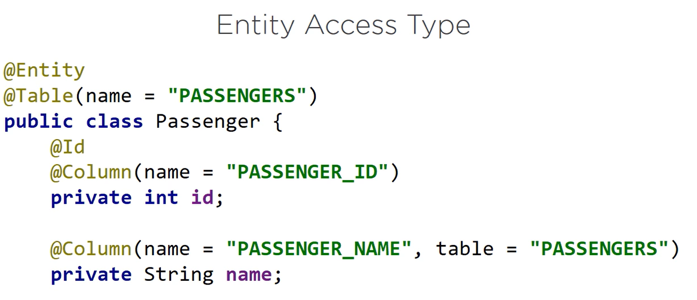
-> acesso baseado em propriedade
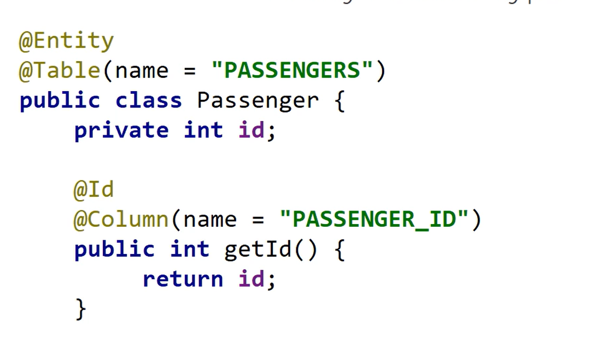

Senão houver anotação o acesso será determinado com base na posição da anotação ID;

@ Access -> O acesso de AccessType.Field aplicado a uma classe de entidade define que o tipo de acesso 
padrão para essa classe é baseado em campo. O runtime de persistencua acessa o estado persistente
por meio das variáveis de instancia.

@Acess-> o acesso de AccessType.Poperty aplicado a uma classe de entidade define os padrões de tipo
de acesso para essa classe sendo baseada em propriedade. O runtime de persistencia acessa
o estado persistente por meio das propriedades.

é possivel designar seletivamente atributos individuais dentro da classe.

Combinando acesso em campo e em propriedade

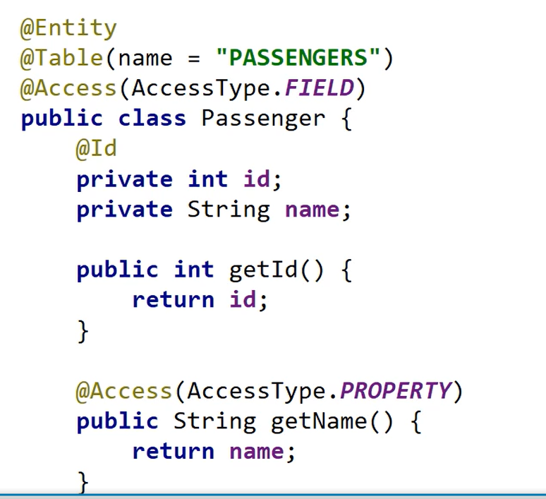

Por que usar acesso a propriedade ou tipo

Usando acesso baseado em  field você pode omitir os métodos getter para os campos que não devem ser 
expostos, os campos são declarados em uma única linha. Enquanto os métodos de acesso se espalham em
várias linhas.
O acesso baseado em field(campo) facilitará a leitura do código.
Os métodos de acesso podem executar lógica adicional. Se isso é o que 
você gostaria que acontecesse ao persistir um objeto você pode usar o acesso baseado em
propriedade. Se a persistencia quiser evitar essas ações adicionais você pode usar o acesso baseado
em campos(fields)

## Definindo chaves primárias de entidade e identidade de entidade 

Definindo Primary Keys.

A chave primária pode corresponder a um ou mais campos ou propriedades sa classe de entidade.
Uma chave primária simples sempre corresponde a um único campo ou propriedade de persistencia.
Você pode usar a anotação @Id para definir uma chave primária simples.

Uma (composite primary) chave primaria composta pode corresponder a um único campo ou propriedade de 
persistencia ou a um conjunto de tais campos ou propriedades.

Rules for Composite Primary Keys( regras para serem aplicadas a chaves primárias compostas)
- Uma classe de chave primaria deve ser pública e deve ter um construtor publico sem argumentos;
- Uma chave primária deve ser serialazable;
- Uma classe de chave primaria deve definir os metodos equals e hascode;
- A semantica da igualdade lógica deve ser cosnsistente com igualdade do BD;
- Uma classe de chave primária pode ser representada como uma classe incorporável ou como
uma classe de id;
- Se uma chave primaria for representada como uma classe id, os campos ou propriedades devem
corresponder aos campos e proprriedade da entidade, referindo-se aqui a nomes e tipos.

- A ANOTAÇÃO @GeneratedValue TEM SUPORTE APENAS PARA CHAVES PRIMÁRIAS SIMPLES;
eLA ESPECIFICA UMA ESTRATÉGIA DE GERAÇÃO PARA O VALOR DA CHAVE PRIMÁRIA E É USADA EM CONJUNTO COM
A ANOTAÇÃO DE ID.
Pode ser aplicado a um capo ou propriedade persistente.
- A anotação @GeneratedValue pode receber parâmetros opcionais a estratégia a ser utilizada 
- e o nome do gerador a ser utilizado.

Anotamos a classe com @Embeddable para marcar que ela será incorporada em alguma outra entidade.
Como ela temos que implementar o Serializable
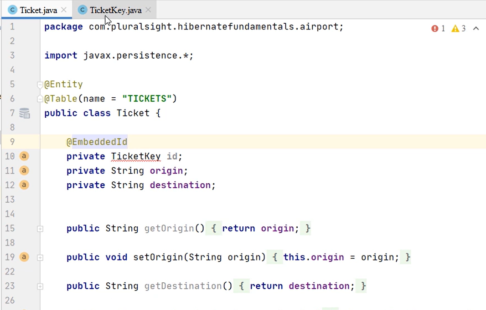
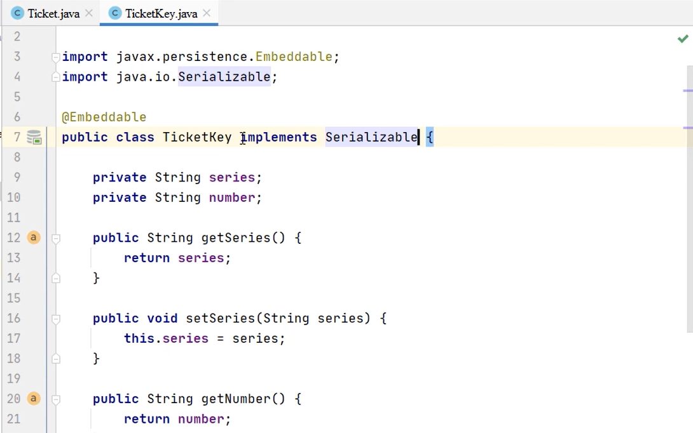

## Relacionamentos e Entidades

Tipos de Reacionamento:

- One-to-many
- Many-to-one
- Many-to-many
- On-to-one
Os relacionamentos podem ser:
- Unidirecionais(o relacionamento tem apenas um lado proprietário)
- Bidirecional (tal relacionamento tem um lado proprietário e um lado inverso)

Qualquer relacionamento , não importa se é unidirecional ou bidirecional ,tem um lado dono. 
Esse lado proprietário direciona as atualizações para o relacionamento em um BD.
Isso significa que este é o lado que incia a mudança do relacionamento.
Em um relacionamento one-to -many e many-to-one a parte muitos do relacionamento é sempre o lado proprietário
Ele contém a referencia física  como uma chave estrangeira.
Se houver necessidade d alterar a relação entre dois registros , a solicitação virá desse lado.
O lado inverso de um relacionamento bidirecional deve se referir ao seu lado proprietário. 

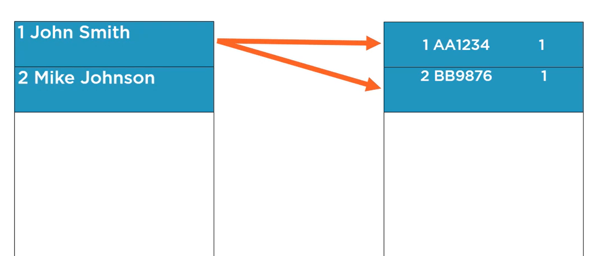
O passageiro, john Smith , com ID 1 tem vários bilhetes, e o ID 1 é mantido em muitos
lados com uma chave estrangeira. Se precisarmos alterar o relacionamento para que os tickets 
não pertençam mais a John Smith com ID1, mas a Mike com ID2, alteramos a chave estrangeira no
lado proprietário.
A gora o passageiro Mike Johson com ID2 é o proprietário dos bilhetes, o id 2 é mantido
em muitos lados como uma chave estrangeira. é o lado muitos como dono que mudou a relação.
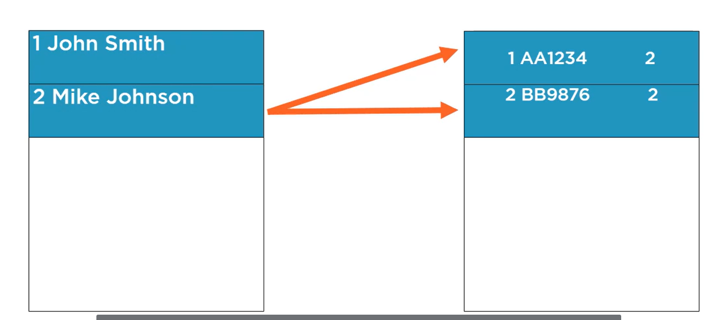

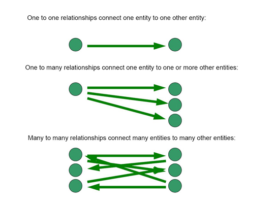

Nas associações OneToMany e ManyToOne vamos ter o conceito de entidade proprietária e entidade
não proprietária. A entidade proprietária da relação é aquela entidade que possui a chave 
estrangeira da outra entidade. Em geral, a entidade que está do lado *Many será a proprietária.
Se pensarmos de forma lógica, só nela que poderemos ter uma chave estrangeira da outra, pois 
cada elemento da entidade proprietária tem associação com apenas um elemento da entidade 
referenciada.

- https://raquelvl.github.io/psoft/material/back_relacionamentosJPA.html
## Anotações úteis para definição de relacionamento são:
@JoinTable-> especifica a tabela de referencia cruzada para o mapeamento de um relacionamento;
Ele deve ser especificado do lado do proprietário de um relacionamento;
Pode receber parâmetros como o nome da tabela de referencia cruzada;
@JoinTable usará uma tabela separada para manter o relacionamento entre Ae B.

@JoinColumn-> Joincolumn especifica uma coluna para ingressar em uma associação de entidade. Pode receber vários parametros com
o nome da chave estrangeira ou o nome da coluna referenciada por esta coluna de chave estrangeira.
@JoinColumn definirá a chave estrangeira da tabela de destino (por exemplo B_ID, ) 
enquanto estiver usando a tabela de entidade de destino (por exemplo B, ).

@JoinColumns> define o mapeamento para cheaves estrangeiras compostas. Agrupa JoinColumn.
O parametro value especifica uma matris de JoinColumn definindo uma chave estrangeira
composta.

## @Embeddable Classes

A s  classes incorporáveis (embeddable) são classes refinadas que representam o estado da entidade.
Eles não tem identidade própria persistente.
Eles não podem ser compartilhadas entre entidades persistentes.
Uma entidade pode ter coleções de incorporáveis, bem como atributos embeddable(incorporáveis) de valor único.
E eles existem apenas como parte do estado da entidade a que pertencem.
As classes incorporáveis devem ser anotadas como @Embeddable
A personalização do mapeamento das classes incorporáveis pode ser feita com a ajuda de @AttributeOverride que substitui
o mapeamento de um determinado campo ou propriedade de uma classe incorporável, e com @AttributeOverrides, que substitui os
mapeamentos de várias propriedades ou campos.
JPA oferece suporte a coleções de tipos básicos ou classes incorporáveis para uma entidade.

As anotações mais uteis são @ElementCollection, que define a coleção de instancias de um tipo básico ou classe incorporável,
que especifica a tabela que é usada para o mapeamento de coleções dos tipos básicos ou incorporáveis.
Todos os tipos de coleção java - coleção list, set, map, são suportados 

O JPA também suporta o mapeamento de classes incorporáveis e tipos básicos para mapear.
A chave e o valor podem ser um tipo básico ou uma classe incorporável., pelo o menos uma das chaves ou valores deve ser um tipo básico.
As anotações úteis são @MapKeyColumn que especifica o nome da coluna para a chave do mapa se a chave for do tipo básico,
e @Column que especifica a coluna para o valor do mapa se o valor for um tipo básico

Com embeddable podemos embutir classes em entidades;

## Abstract Entity Classes

Uma classe de entidade pode herdar de outra classe entidade. 
Uma classe abstrata pode ser especificada como uma entidade.
é claso que o princípio POO ainda se aplica a classe e não pode ser instanciada diretamente.
A classe abstrata definirá o estado persistente a ser herdado por suas subclasses. 
Uma classe de entidade abstrata será anotada com a @Entity, será mapeada como uma entidade e poderá ser alvo de consultas.
JPA suporta associações polimórficas e consultas para entidades.
Uma entidade pode herdar de uma superclasse que fornece estado de entidade persistente e informações de mapeamento, mas que não é
uma entidade. O objetivo dessa suprclasse mapeada é definir informações de estado e mapeamento que sejam comuns a várias subclasses de entidade.
é como um modelo para entidades sem sua própria persistencia. A superclasse mapeda não pode ser consultada. 
A superclasse mapeada pode definir apenas relacionamentos unidirecionais.
A anotação @MappedSuperclass é usada para especificar uma classe sendo uma superclasse mapeada(indicando que ela não tem a sua propria persistencia 
mas o estado definido e as informações de mapeamento comuns a a várias subclasses de entidades.
As anotações @AttributeOverride e @AssociationOverride são usadas para substituir o mapeamento das classes concretas.
Uma entidade pode ter como superclasse uma não entidade. Esta pode ser uma classe abstrata ou concreta.
O estado de tal superclasse não entidade não é persistente.
Ele é usado para herdar apenas o comportamento.
A estrutura de persistencia ignorará as anotações desse tipo de superclasse.

## Estratégias de mapeamento

Existem 3 estratégias básicas que podem ser usadas ao mapear uma classe ou uma hierarquia de classes para um BD relarional.

- Tabela Unica por hierarquia de classe(Single table per classe hierarchy: uma unica tabela será o resultado de toda a 
hierarquia de classes;

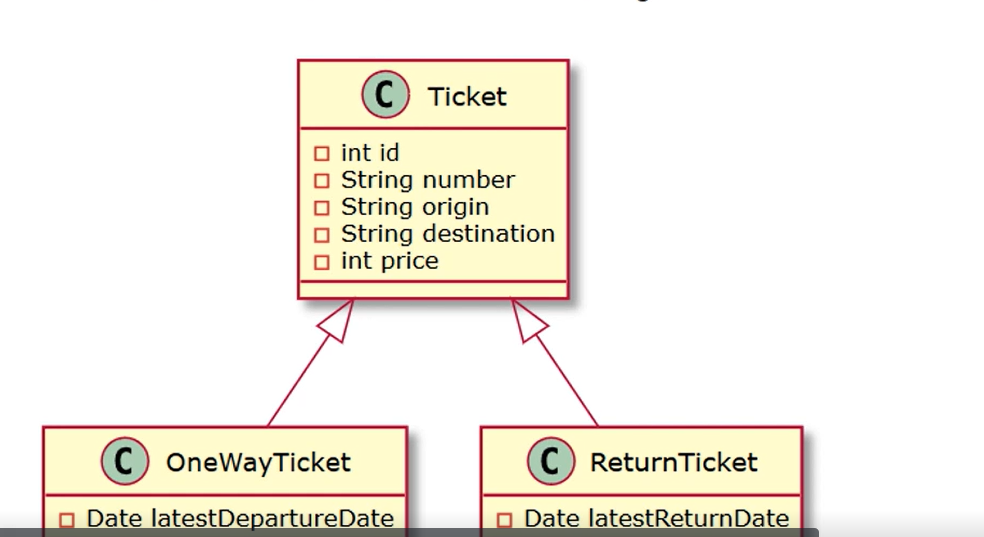

A aplicação da hierarquia de tabela unica por classe obterá uma única tabela, TICKETS , que será o resultado de toda a hierarquia de classes.
Eala contém a união de todos os campos da superclasse e das subclasses.
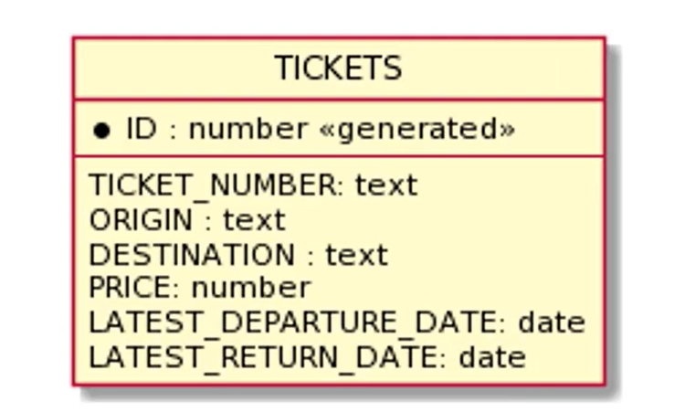

Existe uma superclasse de Ticket e duas subclasses;

No single table todas as hierarquias são mapeadas para uma única tabela.
A tabela tem uma coluna que serve como coluna discriminadora, os valores desta coluna identificam o excedente específico;
Como vantagem A estratégia fornece um bom suporte para relacionamentos polimórficos.
Como desvantagem requer que as colunas correspondentes aos estados específicos das subclasses sejam anuláveis.

Anotações usadas para single table 
@Inheritance (ela é especificada na classe de entidade que é a raiz da hierarquia de classe de entidade a estratégia padrão é 
herança a Type.singleTable)
@DiscriminatorColumn( é especificado apenas na raiz da nossa hierarquia de classes de entidades. Se a anotação não tiver o nome da Discriminator
Column, seu nome padrão será o tipo, e seu tipo será string)
@DiscriminatorValue : especifica o valor do DiscriminatorColumns para entidades do tipo fornecido. Ele só pode ser especificado 
nas classes de entidades concretas. Se a anotaçao não for especificada e o DiscriminatorColumn for usado, o valor padrão do discriminator será o nome da classe.

- Estratégia de subclasse unida(Joined subclass strategy):os campos específicos de uma subclasse são mapeados para uma 
tabela separada dos campos cimuns á classe pai, e a junção(join) é executada para instanciar a subclasse. 
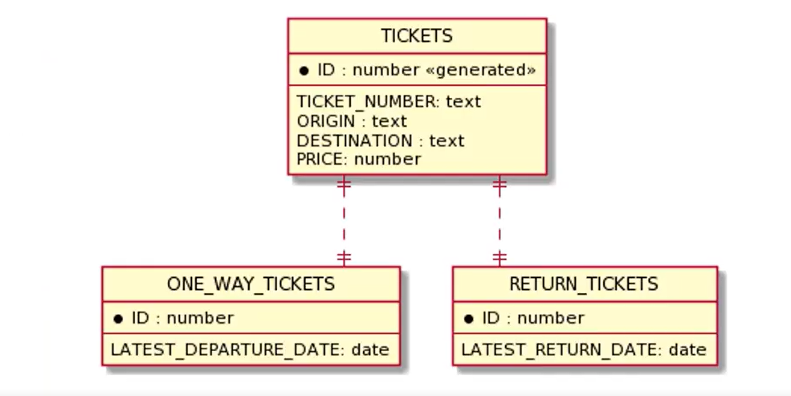
Para uma Joined subclass os campos especificos de uma subclasse são mapeados para uma tabela separada,
A raiz da hierarquia de classes é representada por uma unica tabela(TICKETS)
Cada subclasse é representada por uma tabela separada que  contém campos específicos dessa subclasse.
A junção entre as tabelas é feita através da coluna de chave primária da tabela da superclasse, que serve como chave estrangeira 
para a chave primária da tabela da subclasse.
Como vantagem a estratégia fornece um bom suporte para relacionamentos polimórficos.
Como desvantagem requer que uma ou mais operações de junção(join) sejam executadas entre a entidade que modela a 
subclasse e a entidade que modela a superclasse. As junções geralmente podem levar a um desempenho ruim.

- Tabela por classe de entidade concreta( Table per concrete entity class): apenas as classes concretas serão transformadas em tabelas,
não haverá tabela concreta para a superclasse.
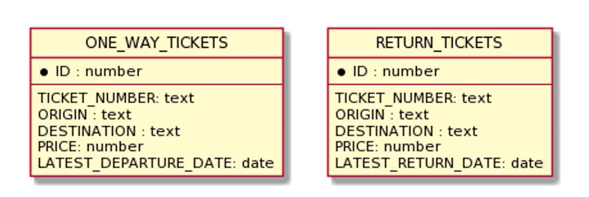
Apenas as classes concretas serão transformadas em tabelas. Aqui vemos que não existe uma tabela de tickets, e temos duas tabelas.
Os campos(fields) que foram encontrados originalmente na superclasse de ticket agora estão duplicados
Usando essa estratégia por classe de entidade concreta cada subclasse é mapeada para uma tabela separada.
Todas as propriedades da classe, incluindo as propriedades herdadas da hierarquia são mapeadas para as colunas da tabela da classe.
Essa estratégia oferece um suporte fraco para relacionamentos polimórficos. Normalemnte requer uma união SQL
para consultas que abordam a hierarquia de classes. Isso pode levar a possiveis problemas usando estratégia de geração de ID.

## EntityManager API

O que é EntityManger ?
EntityManger é uma interface que define métodos para interagir com o contexto de persisntencia.
O contexto de persistencia é um conjunto de instancias de entidades.
Para qualaquer identidade de entidade, há uma instancia de entidade exclusiva. 
As instancias de entidades e seus ciclos de vida são gerenciados dentro do contexto de persistencia.
Uma unidade de persistencia é definida como o conjunto de entidades gerenciadas por uma determinada instancia do EntityManager.

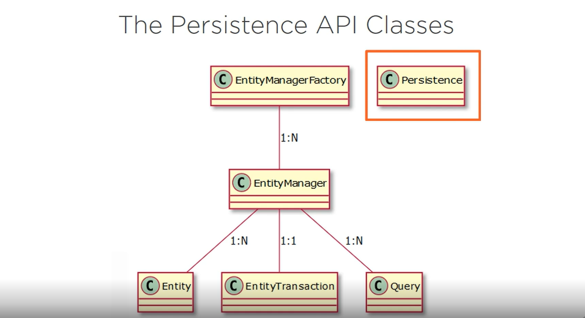

A classe de persistencia do pacote javax.persistence fornece métodos utilitários estáticos para criar instancias de EntityManagerFactory
de maneira neutra em relação ao fornecedor.
A classe EntityManagerFactory do pacote javax.persistence é a fábrica para EntityManagers. 

A classe EntityManager é a interface JPA primária usada por um aplicativo.
Cada EntityManager gerencia um conjunto de objetos persistentes e possui APIs para inserir,atualizar ou excluir objetos.
Quando usado fora de conteineres, há um relacionamento de1:1 entre um EntityManager e um EntityTransaction.

Entidades(Entity) são objetos persistentes que correspondem aos registros do BD.
A interface de consulta Query encontrará objetos persistentes que atendam a determinados critérios.
Uma instancia de consulta é obtida de um EntityManager que também é uma fábrica para instancias de consultas.

Uma EntityTransaction executará operações em dados perssitentes como unidades indivisíveis que são complemente bem-sucedidas ou falham completamente.
A execução tudo ou nada é uma das particularifades das transações.
Se eles falharem completamente, o BD permanecerá em seu estado anterior.
As execuções transacionais são importantes para a integridade dos dados. 
Há um relacionamento 1:1 entre um EntityManager e um EntityTransaction.

## States Entity

Uma instancia de entidade pode estar entre um dos seguintes estados:

- new (nova) : quando uma nova instancia de entidade é criada, ela não tem identidade persistente e não está associada
a nenhum contexto d persistencia.
- manager(gerenciada): é uma instancia com a identidade persistente associada ao contexto de eprsistencia.
- removed(removida): é uma instancia com uma identidade persistente associado ao contexto de persistencia
a ser removido do BD quando a transação for confirmada. 
- detach( desanechada):é uma instancia com a identidade persistente, mas não associada a nenhum contexto de persistencia. 

## The EntityManger Methods

A interface EntityManger define os seguintes métodos de gerenciamento de entidades:
persist()-> torna uma instancia de entidade gerenciada e persistente.
remove()-> remove uma instancia de entidade
merge()-> é o estdo de uma entidade no costesto de persistencia atual. 
find()-> encontra uma entidade usando uma chave primária.
lock()-> bloqueia uma instancia de entidade do constexto de persistencia usando um tipo de modo de bloqueio especificado.
detach()-> desanexar remover uma entidade do constexto de persistencia. A entidade gerenciada torna-se desanexada.
refresh()-> atualizar é o estado da instancia , que recarrega no BD. qUALQUER ALTERAÇÃO NELE SÃO SUBSTITUIDAS.

Analisar os efeitos da aplicação de diferentes métodos em uma entidaade dependendo do estado atual da entidade.

Aplicando o método persist em uma nova entidade , esta passa a ser gerenciada.  A entidade é salva no BD quando a transação é 
confirmada ou como resultado da operação de liberação.
new=> Managed

Aplicando o método persist em uma entidade gerenciada, ele é ignorado pela operação persist, no entanto a operação persiste
em cascata para entidades referenciadas pela entidade gerenciada.
Managed-> Ignored, cascades to referenced entities.

Aplicando persist em uma entidade desanexada ,uma exceção póde ser lançada quando a operação de persistencia é invocada,
ou uma exceção pode ser lançada quando commit ou flus é executado.
Detached-> Exception

Aplicando persist em uma entidade removida, esta se torna gerenciada.
Removed-> Managed

## Usando o merge Method

Executando o método de merge propagamos o estado de entidades desvinculadas para entidades persistentes gerenciadas pelo EntityManger.

Aplicando o método de mesclagem em uma nova entidade uma nova cópia gerenciada da entidade existente é criada e o estado 
da primeira entidade é copiado para o da nova instancia.
new=> new intance with the same state created

Aplicando o método de merge a uma entidade gerenciada  ele é ignorado pela operação de merge. No entanto a operação
de mesclagem é em  cascata para entidades referenciadas pela entidade gerenciada.
Managed=> IGNORED, CASCADE TO REFERENCED ENTITITES

Aplicando a mesclagem em uma entidade desvinculada a entidade existente é carregada e o estado da entidade de mesclagem é copiado para ela.
Detached=> existing entity loaded, state merged.

Aplicando a mesclagem em uma instancia de entidades removidas, ILLegalArgumentsException será lançada.

## Using the remove Method

Analisando os efeitos da aplicação do método remove em uma entidade dependendo do estado atual da entidade.

Aplicando o método remove em uma nova entidade , a operação é ignorada.
new-> ignored

Aplicand o método remove em uma entidade gerenciada, a entidade é removida. A operação de remoção é em cascata para entidades
referenciadas pela entidade gerenciada.
Managed-> Removed, cascaded to referenced entities

Aplicando o método remove em uma entidade detached, um IllegalArguemntsException será leançado. 
Detached-> IllegalArgumentException

Aplicando o método removed em uma entidade removida, a operação é ignorada. Uma entidade removed será removida do BD quando a transação for 
confirmada ou como resultado da operação de liberação.
Removed-> Ignored

## Using the refresh Method

Aplicando o método de atualização em uma entidade Managed, o estado da entidade é atualizado a partir do BD.Possiveis alterações
anteriores na entidade serão substituídas.
Managed-> Entity reloaded from de database

A operação de atualização é em cascata para entidades referenciada pela entidade gerenciada.
Referenced entities cascaded

Aplicando o método de refresh(atualização) numa entidade new/detached /removed uma IllegalArgumentsException será lançada.
NEW/detached/removed-> IllegalArgumentsException

## Synchronize the Database with commit and flus.

O estado das entidades persistentes é sincronizado com o BD de duas maneiras:

Por meio da confirmação da transação ou da operação de liberaçao:

Chamar commit irá liberar a sessão e também encerrará a unidade de trabalho. A transação não pode ser revertida(rollback)
commit- ends the unit of work, no rollback

Chmar flush- apenas faz uma sincronização normal da sessão. As alterações não são confirmadas.
flush: normal synchronization, no commit.

## Obtaining an Application-managed EntityManager

O EntityManager para um contexto de persistencia pode ser obtido de um EntityManagerFactory.
Será um EntityManager gerenciado por aplicativo e você terá que controlar programaticamente todo o ciclo de vida
desse objeto.
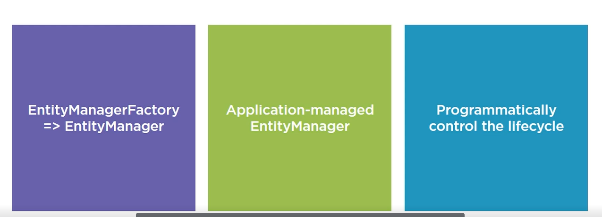

O EntityManager gerenciado por conteiner é obtido por meio de injeção de dependencia. Isso significa que contaremos com um
container para injetar o EntityManger que precisamos para nosso aplicativo.
Spring é um framework que tem em seu cerne a injeção de dependencia ou inversão d controle. Isso significa que nossos 
objetos são gerenciados por um container que será responsável por controlar seus ciclos de vida e gerencias as dependencias
entre eles.
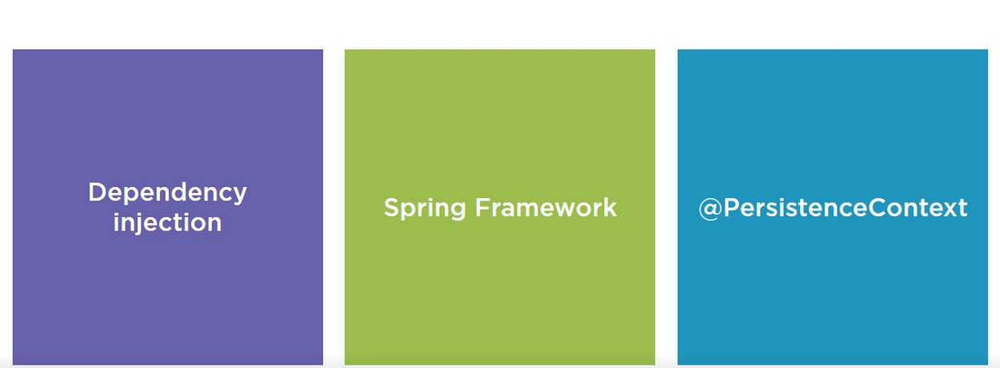

